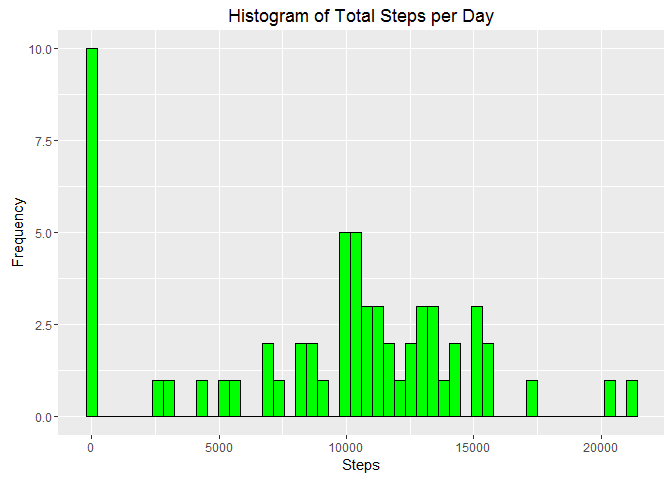
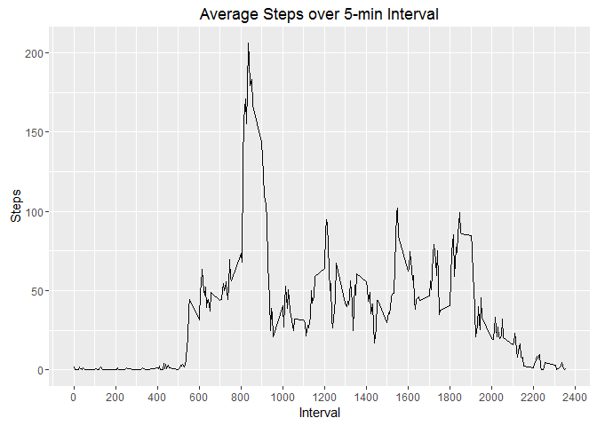
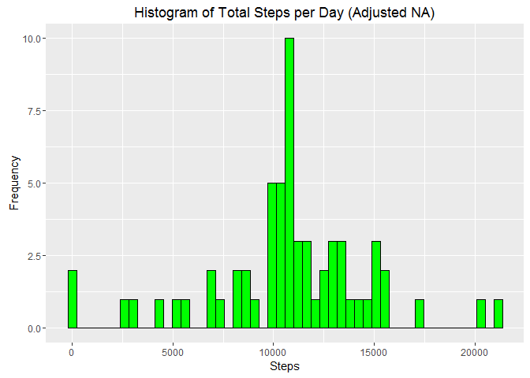
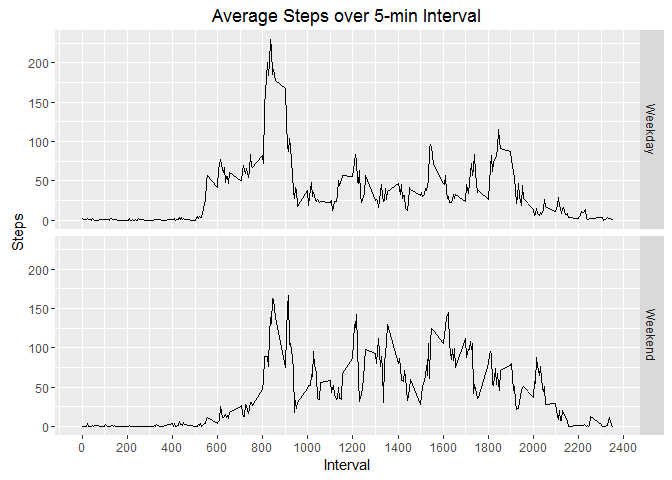

# Activity Monitoring Data
Tony Li  
November 19, 2016  

Loading the raw data and appropriate packages into R
====================================================


```r
library(dplyr)
library(readr)
library(ggplot2)

activity <- read_csv("activity.csv")
```

What is the mean total number of steps taken per day?
=====================================================

Summarizing the steps in *activity* data table for each day:


```r
activity2 <- activity %>%
    group_by(date) %>%
    summarise(steps = sum(steps, na.rm=TRUE))
```

Here's a sample from *activity2* data table:

```
## # A tibble: 10 × 2
##          date steps
##        <date> <int>
## 1  2012-10-01     0
## 2  2012-10-02   126
## 3  2012-10-03 11352
## 4  2012-10-04 12116
## 5  2012-10-05 13294
## 6  2012-10-06 15420
## 7  2012-10-07 11015
## 8  2012-10-08     0
## 9  2012-10-09 12811
## 10 2012-10-10  9900
```

Here's a histogram of total steps per day:

```r
ggplot(data=activity2, aes(x=steps)) +
    geom_histogram(color="black", fill="green", bins=50) +
    labs(title="Histogram of Total Steps per Day", x="Steps", y="Frequency")
```

<!-- -->

We want to find out the average and median daily total number of steps.

```r
avg_steps_day <- mean(activity2$steps, na.rm = TRUE)
med_steps_day <- median(activity2$steps, na.rm = TRUE)

avg_steps_day
```

```
## [1] 9354.23
```

```r
med_steps_day
```

```
## [1] 10395
```

The average daily total number of steps is approximately 9354 steps.  
The median daily total number of steps is 10395 steps.

What is the average daily activity pattern?
===========================================

We want to make a time-series plot of the 5-minute interval and the average number
of steps taken, averaged across all days. 

First, summarizing the steps in *activity* data table by interval:

```r
activity3 <- activity %>%
    group_by(interval=interval) %>%
    summarise(avg_steps = mean(steps, na.rm=TRUE))
```

Here's a sample from *activity3* data table:

```
## # A tibble: 10 × 2
##    interval avg_steps
##       <int>     <dbl>
## 1         0 1.7169811
## 2         5 0.3396226
## 3        10 0.1320755
## 4        15 0.1509434
## 5        20 0.0754717
## 6        25 2.0943396
## 7        30 0.5283019
## 8        35 0.8679245
## 9        40 0.0000000
## 10       45 1.4716981
```


Here's the time-series plot showing the total steps over the 5-min intervals:


```r
ggplot(data=activity3, aes(x=interval, y=avg_steps)) +
    geom_line() +
    labs(title="Average Steps over 5-min Interval", x="Interval", y="Steps") +
    scale_x_continuous(breaks=seq(0,max(activity3$interval)+100,200))
```

<!-- -->

We want to find out which interval has the maximum number of steps:

```r
max_steps_5min <-  activity3[which.max(activity3$avg_steps),]
max_int <- max_steps_5min$interval
max_steps <- max_steps_5min$avg_steps

max_int
```

```
## [1] 835
```

```r
max_steps
```

```
## [1] 206.1698
```
The 5-min interval that contains the maximum number of steps is 835 to 
840 minute which has on average 206 number of steps.  


Imputing Missing Values
=======================

So far we have been ignoring the existence of missing values ("NA"), which can
introduce bias into some calculations.  

Calcuting the total number of missing values in the dataset:

```r
sum(is.na(activity$steps))
```

```
## [1] 2304
```

There are 2304 rows with missing value. Since we already
calculated the average number of steps for each 5-min interval, let's fill in
the missing values with the averages for the interval they are in. Remember that
the averages are in *activity3* data table.


```r
idx <- is.na(activity$steps)
na_intervals <-activity$interval[idx]
activity$steps[idx] <- activity3$avg_steps[match(na_intervals, activity3$interval)]
```

Now let's check if there is any missing values in the *activity* dataset:

```r
sum(is.na(activity$steps))
```

```
## [1] 0
```
No more missing values!


Using the new data table, let's plot the histogram again and re-calculate the
mean and median daily total number of steps.  

Here is the histogram:

```r
activity2_adjNA <- activity %>%
    group_by(date) %>%
    summarise(steps = sum(steps))

ggplot(data=activity2_adjNA, aes(x=steps)) +
    geom_histogram(color="black", fill="green", bins=50) +
    labs(title="Histogram of Total Steps per Day (Adjusted NA)", x="Steps", y="Frequency")
```

<!-- -->

Comparing to the first histogram we plotted without filling in the missing values, we
see that the frequency at 0 steps decreases, and the frequency at center increased.
This is expected since we did fill in the missing data with the average!  

Here's the new mean and median, respectively:

```r
avg_steps_day_adjNA <- mean(activity2_adjNA$steps)
med_steps_day_adjNA <- median(activity2_adjNA$steps)

avg_steps_day_adjNA
```

```
## [1] 10766.19
```

```r
med_steps_day_adjNA
```

```
## [1] 10766.19
```

The mean increased from 9354 steps to 10766 steps.  
The median increased from 10395 steps to 10766 steps.  
The new mean and median are the same due to the fact that we added the mean to the 
missing values.


Are there differences in activity patterns between weekdays and weekends?
==========================================================================

We will create a new factor variable called *wk* with two levels - "weekday"
and "weekend" indicating whether a given date is a weekday or weekend.


```r
activity$wk <- weekdays(activity$date)
activity$wk[activity$wk=="Saturday" | activity$wk=="Sunday"] <- "Weekend"
activity$wk[activity$wk!="Weekend"] <- "Weekday"
```

Here is a sample of the data set with the new variable:

```
## # A tibble: 10 × 4
##        steps       date interval      wk
##        <dbl>     <date>    <int>   <chr>
## 1  1.7169811 2012-10-01        0 Weekday
## 2  0.3396226 2012-10-01        5 Weekday
## 3  0.1320755 2012-10-01       10 Weekday
## 4  0.1509434 2012-10-01       15 Weekday
## 5  0.0754717 2012-10-01       20 Weekday
## 6  2.0943396 2012-10-01       25 Weekday
## 7  0.5283019 2012-10-01       30 Weekday
## 8  0.8679245 2012-10-01       35 Weekday
## 9  0.0000000 2012-10-01       40 Weekday
## 10 1.4716981 2012-10-01       45 Weekday
```

Here is a time-series of total steps by 5-min interval, but broken up by weekdays
and weekends:

```r
activity3_adjNA <- activity %>%
    group_by(interval=interval, wk=wk) %>%
    summarise(avg_steps = mean(steps))

ggplot(data=activity3_adjNA, aes(x=interval, y=avg_steps)) +
    geom_line() +
    facet_grid(wk~.) +
    labs(title="Average Steps over 5-min Interval", x="Interval", y="Steps") +
    scale_x_continuous(breaks=seq(0,max(activity3_adjNA$interval)+100,200))
```

<!-- -->


